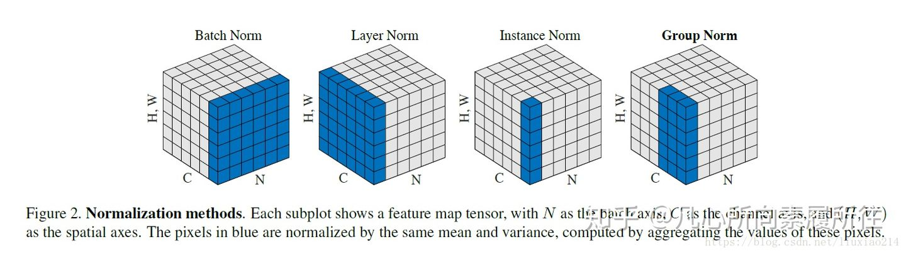

## 卷积
- 公式： $f(x)=wx+b$
- 代码实现
```python
import numpy as np

class conv2d:
    def __init__(self, in_channels, out_channels, size, padding, stride):
        self.in_channels = in_channels
        self.out_channels = out_channels
        self.padding = padding
        self.stride = stride

        self.w = np.random.rand((out_channels, in_channles, size, size)) # 卷积的参数与图像size无关
        self.b = np.zeros((out_channels, 1))
    
    def forwad(self, x):
        # TODO
        return
    
    def backward(self, y):
        # TODO
        return
```
- 参数量; 根据代码实现可知，参数量与图像尺寸无关为 $N_{in}N_{out} K^{2} + N_{out}$
- 计算量; $K^{2}N_{in}N_{out}HW$, H和W为输出feature_map的大小
- $1*1$卷积的作用。(1) 改变通道数 (2) 用于语义分割等密集预测 (3) 等价FC


## 激活函数
- 为什么要有激活函数。卷积的公式为wx+b, 因此是线性拟合，经过多层后依然为线性拟合。然而只有非线性函数可以逼近任意分布，所以需要激活函数引入非线性。
- 常用的激活函数有sigmoid ($f(z)=\frac{1}{1+\exp (-z)}$), ReLU ($max(0, x)$), PReLU, softplus, mish, 除了Sigmoid，基本都是负轴为0, 正轴线性的形式。sigmoid存在梯度计算复杂，无限大时梯度消失的问题，所以基本不再使用。

## Noramlization (BN/IN/LN/GN)
- BN的作用。(1) 通过减均值除方差的方式将激活控制为均值为零，方差为1的分布，稳定的数据分布可以加速收敛。(2) 每次batch标准化不同，可缓解一定过拟合问题
- BN的实现。$bn(x) = \gamma\frac{x-mean}{sqrt} + \beta$, 减去当前batch的均值除以标准差，然后根据BN的参数缩放和平移。
```python
    sample_mean = np.mean(x, axis = 0)
    sample_var = np.var(x, axis = 0)
    x_hat = (x - sample_mean) / np.sqrt(sample_var + eps)
    out = gamma * x_hat + beta
```
- BN如何合并到卷积中。BN本身和卷积一样是一个线性运算，因此可以将BN的weight和bias合并到conv中，conv用公式表示为$conv(x)=wx+b$,  bn用公式表示为$bn(x) = \gamma\frac{x-mean}{sqrt} + \beta$, 最终公式为 $bn(conv(x))=\gamma\frac{wx+b-mean}{sqrt} + \beta= (\frac{\gamma w}{sqrt})x +(\frac{\gamma (b-mean)}{sqrt} + \beta)$ 形成新的weight和bias，替代conv原本的数值
- BN/IN/GN的区别。BN统计$B*W*H$维度，对每个通道标准化; IN统计$W*H$维度，风格化迁移中常用; LN统计$C*W*H$,GN是将通道C分组，对$G*W*H$标准化, 解决Batch较小时的情况; 具体解释可参考[BN/LN/IN/GN的区别](https://zhuanlan.zhihu.com/p/115949091)


## 梯度下降和反向传播
- 梯度下降定义： $w^{+}=w-\eta \cdot \frac{\partial L}{\partial w}$, 分别对每一个$w$求偏导，更新$w^{+}$
- 反向传播和链式求导：主要依赖于梯度下降和链式求导公式$\frac{\partial L}{\partial w}=\frac{\partial L}{\partial y} \cdot \frac{\partial y}{\partial w}$
- GD (Gradient Descent). 理论上的梯度下降，送入整个数据集后，进行一次梯度下降，$w^{+}=w-\eta \cdot \frac{\partial L}{\partial w}$
- SGD (Stochastic Gradient Descent)。仅计算mini-batch的梯度。
- Momentum。平滑，乘以一个系数，加上过去的收敛方向。
  
## L1/L2正则化 (Regularization)
- 正则化的定义。正则化是对损失函数引入的惩罚项, $L(x)=f(x)+\lambda R(x)$。其中正则项$R(x)$以L2正则化为例是参数的平方，使用更多的参数会带来惩罚
- L1/L2正则化。L1正则化$R(x)= |W|$, L2正则化 $R(x) = |W^{2}|$。L1正则化会比L2正则化权重更稀疏，会依赖个别特征，不重要特征会置零。从公式上直观解释：因为L1正则化代价是线性的，而L2正则化的带价是非线性的，权重数值较小时，代价更小，所以权重倾向于小而分散。从梯度上解释：W在0附近时，L1正则的导数为常量，而L2正则的导数逐渐减小为0，所以L1正则更容易收敛到0点上。
- 应用。分类检测任务因为数据量很大里几乎不用，GAN中偶尔会有用到。
