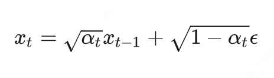
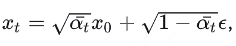
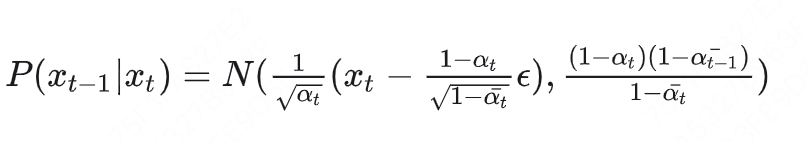

## DDPM & DDIM

DDPM的核心公式： 设定超参数alpha，随着扩散过程，alpha逐渐减少，噪声所占的比例逐渐增加；设定为根号是为了让两者相加后符合方差为1的正态分布；x_t时刻的图像是x_t-1时刻增加了噪声，假如这个噪声可以被模型预测，那我们就可以实现从噪声到图像的去噪过程



- 扩散过程q(x_t | x_t-1)，从t-1时刻到t时刻的加噪声过程，根据以上的核心公式可以推出



- 去噪过程p(x_t-1 | x_t), 从t到t-1时刻的去噪过程



- 代码实现DDPM
```python
class DenoiseDiffuion:
	# 核心公式 x_t = sqrt(alpha_t) * x_t-1 + sqrt(1-alpha_t) * noise
	# 准备超参数alpha和beta，代表强度不同的高斯分布
	def __init___(self, num_time_step=1000):
			self.beta = torch.linspace(0.001, 0.02, num_time_step)
			self.alpha = 1 - self.beta
			self.alpha_bar = torch.cumprod(self.alpha) # [alpha_0, alpha_0 * alpha_1, ...]

	# 正向加噪过程 x_t = sqrt(alpha_bar_t) * x_0 + sqrt(1 - alpha_bar_t) * noise
	def q_sample(self, x0, t, noise):
			alpha_bar_t = self.alpha_bar[t]
			x_t =  sqrt(alpha_bar_t) * x0 +  sqrt(1 - alpha_bar_t) * noise
			return x_t
	
	def p_sample(self, model, x_t, t):
			# 推导过程还需要再仔细了解
			noise = model(x_t, t)
			alpha_bar_t = self.alpha_bar[t]
			alpha_t = self.alpha[t]
			coef = (1 - alpha_t) / sqrt(1 - alpha_bar_t)
			mean = 1 / sqrt(alpha_t) * (x_t - coef * noise)
			var = self.beta[t]
			eps = torch.randn(x_t.shape) # 额外随机噪声
			return mean + sqrt(var) * eps
			
	# loss计算过程，model负责预测noise，
	# loss = (noise - model(q_sample(x0, t, noise), t)) ** 2
	def loss(self, model, x0):
			t = torch.randint(0, 1000) # 随机抽样t
			noise = torch.randn_like(x0) # （0,1)高斯噪声
			x_t = self.q_sample(x0, t, noise)
			pred_noise = model(xt, t)
			return (pred_noise - noise) ** 2
```

## Flow Matching & Rectified Flow

SD3、Flux等模型将DDPM替换成flow-based的方法，加噪去噪的扩散过程并没有改变，但是不再采用DDPM那一套复杂理论来求解t和t-1时刻的变化，而转而采用走直线一步生成的思想，通过一个velocity，从一个分布直接到另一个分布。 

```python
class RectifiedFlow:
		def __init__(num_time_step=1000):
				pass
								
		def loss(model, x0, t):
				noise = torch.randn_like(x0)
				sigmas = torch.sigmoid(torch.randn((x0.shape[0])) # logit-norm timestep非线性采样
				xt = (1 - sigmas[t]) * x0 + sigma[t] *noise
				pred_v = model(xt, t)
				target_v = noise - x0 # velocity

				return (pred_v - target_v) ** 2
		
		def sample(model, x, num_time_step=30):
				# 在0-1000之间采样30步，跨步推理
				sigma = torch.linspace(0.0, 1.0, num_time_step)
				for t in range(num_time_step):
						# dt 代表时刻差
						dt = sigma[t + 1] - sigma[t]
						x = x + v * dt
				return x_prev
```

## Classifier-Free Guidance （CFG)

classifier-free guidance通过组合条件生成和非条件生成的结果，以获取更好的生成结果

训练时以一定概率例如p=0.1将prompt置空，以训练模型的uncondtional生成能力

```python
prompt = '' if random.random() < uncond_drop_prob else prompt
```

推理时按以下代码执行

```python
# 准备两输入，一份是conditional （prompt），另一份是uncondtional （negative prompt）
latent = torch.cat([latent] * 2) 
cond = torch.cat([cond_embed, uncond_embed])
noise_pred = model(latent, cond, **kwargs)
noise_pred_uncond, noise_pred_text = noise_pred.chunk(2)

# 
noise_pred = noise_pred_uncond + \
					self.guidance_scale * (noise_pred_text - noise_pred_uncond)
```