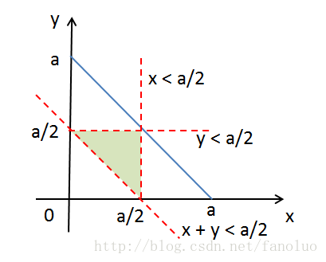

## 纯数学
- 一个长度为a的线段，分成三段，这三段能构成三角形的概率
```
1. 设三条线段长度为 x, y, (a-x-y)
2. x的取值范围为0-a，y的取值范围为0-a，映射到二维坐标系X轴和Y轴，将概率问题转化为面积比例问题
3. 已知构成三角形的必要条件是任意两边之和要大于第三边x+y>a-x-y, 得到x+y>a/2
4. 另一方面，要满足任意两边之和大于第三边，有x<a/2, 和y<a/2
5. 根据以上三个不等式，划分出三角形
```


- 有两条**线段**ab和cd，判断是否相交，求交点，进一步的在不求交点的情况下，如何判断是否相交
```
// sln1： 程序方法：二分法，以a点和b点为left和right，求mid，

```